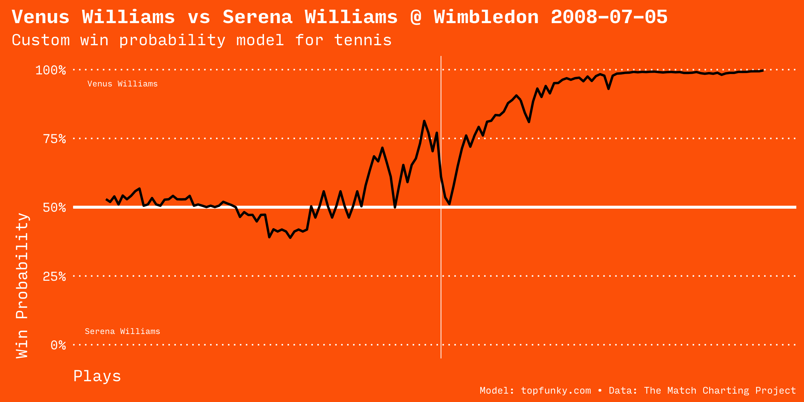
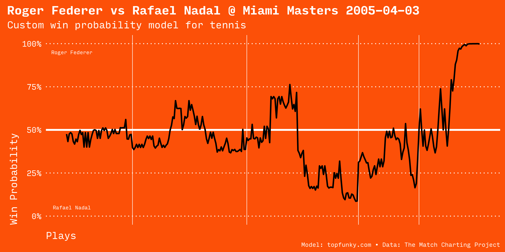

# Tennis In-Game Win Probability with R

An experiment in building an in-game win probability model for tennis matches.

## Sample match

- [Point by point](http://www.tennisabstract.com/charting/20080705-W-Wimbledon-F-Venus_Williams-Serena_Williams.html)

- [Point by point](http://www.tennisabstract.com/charting/20050403-M-Miami_Masters-F-Roger_Federer-Rafael_Nadal.html)
- [Video highlights](https://www.youtube.com/watch?v=QKlXGgbwwJI)

## Accuracy

Women's model

Men's model

## Reference

Data is from the [Match Charting Project](https://github.com/JeffSackmann/tennis_MatchChartingProject).

## Development notes

Data cleanup tasks to do:

- Records are numbered by point `Pts` (approximately 100 per match)
- `Set1` and `Set2` are sets won by player 1 or two
- Same for `Gm1` and `Gm2`
- The model uses points, games, and sets
- The identity of the player serving the ball is not currently included in the model
- Add estimated points (EPA) for potentially even greater accuracy
