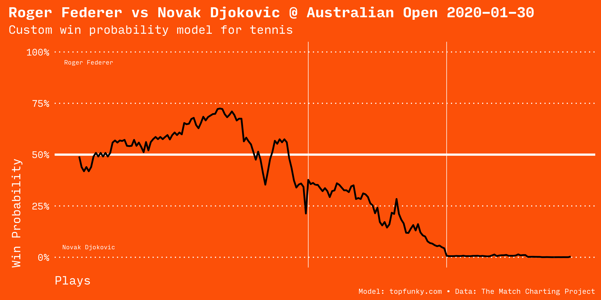

# Tennis In-Game Win Probability with R

An experiment in building an in-game win probability model for tennis matches.

## Sample match

- http://www.tennisabstract.com/charting/20080705-W-Wimbledon-F-Venus_Williams-Serena_Williams.html

- http://www.tennisabstract.com/charting/20200130-M-Australian_Open-SF-Roger_Federer-Novak_Djokovic.html

## Accuracy

Women's model

Men's model

## Reference

Data is from the [Match Charting Project](https://github.com/JeffSackmann/tennis_MatchChartingProject).

## Development notes

Data cleanup tasks to do:

- Records are numbered by point `Pts` (approximately 100 per match)
- `Set1` and `Set2` are sets won by player 1 or two
- Same for `Gm1` and `Gm2`
- `Pts` needs to be split on `-` to find points for each player
- Could extend the model for points (currently uses games and sets)
- Need to add reference lines for games or sets.
